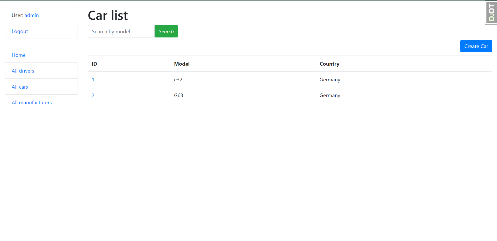

# Taxi-Service

Web application supports authentication, simulation of a simple taxi service.

## Check it out!

[Taxi-service project deploy to Heroku](https://tax-service.herokuapp.com/)

## Installation

Python 3.X must be already installed

```shell
git clone https://github.com/Abnormaltype/Taxi-Service.git
cd Taxi-Service
python3 -m venv venv
source venv/bin/activate
pip install -r requirements.txt
python3 manage.py runserver
```

## Features

* Authentication functionality for Driver(User)
* Powerful admin panel for advanced managing
* Managing cars, drivers and manufacturers directly from website interface

## Access

* username: Username
* password: Admin12345
* Warning! please do not delete users!!!


## Demo




